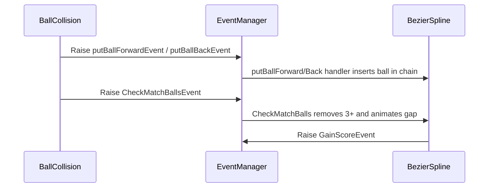

# ZUMA (Unity)

Arcade marble-shooter inspired by Zuma. A chain of colored balls travels along a spline; you aim and shoot to match 3+ of the same color to clear them before they reach the end. Includes a lightweight event system, level selection, and an in-editor level authoring/saving flow.

Unity version: 2020.3.20f1 (LTS)

Play online: https://gnorgol.github.io/Zuma-Project/

## Features

- Marble chain that follows a configurable Bezier/Catmull-Rom spline (`BezierSpline`)
- Player launcher with queued balls, swap, and color validation (`ShootLauncher`)
- Match-3 removal with juicy gap-closing animation and combo scoring
- Event-driven architecture via a tiny `EventManager`
- Game states (Menu, Play, Pause, Game Over, Victory, Credits, Settings, Edit Level) managed by `GameManager`
- Level select (built-in and user-saved levels from persistent data)
- Simple level editor workflow with save/load to `.dat`

## Quick start

1. Open the project in Unity 2020.3.20f1 (LTS). If you see import prompts, accept defaults.
2. Open the main scene in `Assets/Scenes` (e.g., a menu or gameplay scene).
3. Enter Play Mode.

### Controls (default)

- Mouse move: aim the launcher
- Left click: shoot the forward ball
- Right click: swap forward/back balls
- Esc or Pause UI: pause/resume

## Project structure (high-level)

- `Assets/Script/`
	- `Common/`: helpers (timers, math, flags, singletons)
	- `EventManager/`: `Event`, `EventManager`, `IEventHandler`
	- `Manager/`: `GameManager`, `HudManager`, `MenuManager`, `SfxManager`
	- Root scripts: `BezierSpline`, `ShootLauncher`, `RotateLauncher`, `Ball`, `BallCollision`, `EditorLevelManager`, etc.
- `Assets/Resources`, `Assets/Models`, `Assets/Texture`, `Assets/Sfx` … assets

## Core systems and usage

### Event system (SDD.Events)

Lightweight, type-safe pub/sub you can use anywhere (no `MonoBehaviour` required):

```csharp
using SDD.Events;

// Subscribe
EventManager.Instance.AddListener<GainScoreEvent>(OnGainScore);

// Unsubscribe (recommended in OnDisable)
EventManager.Instance.RemoveListener<GainScoreEvent>(OnGainScore);

// Publish
EventManager.Instance.Raise(new GameLevelChangedEvent { eLevel = 2 });

void OnGainScore(GainScoreEvent e)
{
		Debug.Log($"+{e.eScore} points!");
}
```

Events used in this project include: `PlayButtonClickedEvent`, `GameLevelChangedEvent`, `GainScoreEvent`, `FinishCurveEvent`, `DestroyInstanceBallEvent`, and editor-related events.

### Game flow (GameManager)

`GameManager` owns the game state machine, score/best score, level selection, time scale, and level instantiation.

Key states: `gameMenu`, `gamePlay`, `gamePause`, `gameOver`, `gameVictory`, `gameCredit`, `gameSetting`, `gameEditLevel`.

Example: start a specific level from code

```csharp
using SDD.Events;

// Start selected level (1-based index)
EventManager.Instance.Raise(new GameLevelChangedEvent { eLevel = 1 });
```

`GameManager` will instantiate either a built-in prefab (from `m_ListLevel`) or load a saved level from `Application.persistentDataPath` when the index exceeds the prefab list.

Score is raised via:

```csharp
EventManager.Instance.Raise(new GainScoreEvent { eScore = 10 });
```

### Spline and chain (BezierSpline)

The spline builds a dense point set for efficient marching and sphere-to-spline intersection. The marble chain is kept at collision distance along the path with gap-closing and small “punch” scale feedback for juice.

Common knobs (Inspector or code):

- `NbPtsOnSpline`, `PtsDensity`: resolution
- `IsClosed`: loop path
- `TranslationSpeed`: chain speed (sign controls direction)
- `Repeat`: loop travel
- `NbBall`, `ListBall`: initial chain content/prefabs

Spawn/enable a spline level at runtime:

```csharp
var level = Instantiate(levelPrefab);
var bs = level.GetComponent<BezierSpline>();
bs.enabled = true;
bs.SetInstantiate(true);     // start listening & broadcasting chain colors
bs.NbBall = 30;              // number of marbles
// Optional juice tuning per level
bs.SetGapCloseTuning(duration: 0.26f, overshoot: 1.4f);
bs.SetInsertionTuning(duration: 0.18f, overshoot: 1.3f);
```

When 3+ contiguous balls of the same color are formed, `BezierSpline` removes them, raises `GainScoreEvent`, and animates the gap to close. When the chain is fully cleared during Play, the next level is auto-started via `GameLevelChangedEvent`.

### Player launcher (ShootLauncher)

- Maintains two queued balls: forward (to shoot) and back (to swap)
- Ensures the ball color matches current chain palette (adapts if a color disappears)
- Emits `PlayerShootEvent` on fire; uses `Ball` component to move the projectile

Typical flow in Update during Play:

```csharp
if (Input.GetKeyDown(KeyCode.Mouse0)) // left click
{
		Shoot();                    // fires forward ball along aim
		EventManager.Instance.Raise(new PlayerShootEvent());
		CreateBallForward();        // refill forward with new random color
		SwapBall();                 // back becomes forward
}
else if (Input.GetKeyDown(KeyCode.Mouse1)) // right click
{
		SwapBall();                 // swap without shooting
}
```

## Level authoring and saving

You can author splines in the editor and save them for use in the level select.

- Use `EditorLevelManager` UI/tools to add/move/delete control spheres.
- Click Play (in the editor tools) to preview chain movement on the path.
- Click Save to serialize the curve into a `.dat` file under `Application.persistentDataPath`.
- At runtime, `GameManager` lists all `*.dat` files and appends them to the level dropdown after built-in prefabs.

Loading is handled by `GameManager.LoadLevel(string name)` which deserializes, rebuilds control spheres and a `LineRenderer`, and attaches a configured `BezierSpline`.

Note: saved files are engine-version-agnostic binary data written via `BinaryFormatter` for this project; they live outside the repo by design.

## Customization tips

- Chain feel
	- Increase `TranslationSpeed` on `BezierSpline` for difficulty
	- Tweak `SetGapCloseTuning` and `SetInsertionTuning` for snappier/slower juice
	- Adjust `_spacingMultiplier` in `BezierSpline` slightly above 1 to reduce overlaps on tight turns
- Colors
	- Set materials on `ShootLauncher` (Red/Green/Blue/Yellow)
	- The launcher auto-adapts a queued ball’s color to remain valid vs. the chain palette
- Levels
	- Add level prefabs to `GameManager.m_ListLevel`
	- User-saved levels appear after the built-in list in the dropdown

## Build

Use File → Build Settings… and include your gameplay/menu scene(s). Target any platform Unity supports. On first open, reassign scene references in managers if Unity lost them after an import.


## Code reference

Key scripts in `Assets/Script`:

- Gameplay core
	- `Assets/Script/BezierSpline.cs`
		- Public tuning: `TranslationSpeed`, `NbPtsOnSpline`, `PtsDensity`, `IsClosed`, `Repeat`, `NbBall`, `ListBall`
		- Methods: `SetInstantiate(bool)`, `SetGapCloseTuning(float duration, float overshoot)`, `SetInsertionTuning(float duration, float overshoot)`
		- Events consumed: `putBallForwardEvent`, `putBallBackEvent`, `CheckMatchBallsEvent`, `DestroyLevelExempleEvent`, editor events
		- Emits: `GainScoreEvent`, `FinishCurveEvent`, `AllColorsBallsCurveEvent`, `GameLevelChangedEvent` (when chain cleared)
	- `Assets/Script/Ball.cs`
		- Methods: `Setup(Vector3 shootDir)` assigns velocity; moves forward in `Update()`; self-destroys `OnBecameInvisible()`
	- `Assets/Script/BallCollision.cs`
		- On collision with `ActiveBalls`, raises `putBallForwardEvent`/`putBallBackEvent` then `CheckMatchBallsEvent`

- Player
	- `Assets/Script/ShootLauncher.cs`
		- Fields: forward/back instances, color materials, cooldown, `shootEndPosition`
		- Emits: `PlayerShootEvent`
		- Listens: `GameLevelChangedEvent`, `AllColorsBallsCurveEvent`, `DestroyInstanceBallEvent`
		- Ensures queued balls use colors present in chain
	- `Assets/Script/RotateLauncher.cs`: rotates the launcher based on input (aim)

- Management
	- `Assets/Script/Manager/GameManager.cs`
		- State: `GameState` enum, properties `IsPlaying`, `IsMenu`, etc.
		- Level flow: listens to UI events; instantiates built-in or saved levels; pauses/resumes; victory/over
		- Persistence: lists `*.dat` under `Application.persistentDataPath` and populates Dropdown
	- `Assets/Script/Manager/HudManager.cs`, `MenuManager.cs`, `SfxManager.cs`: UI and audio glue

- Events
	- `Assets/Script/AllEvents.cs`: strongly-typed events (Menu/UI, Score, Gameplay, Editor)
	- `Assets/Script/EventManager/EventManager.cs`: generic pub/sub
	- `Assets/Script/EventManager/Event.cs`, `IEventHandler.cs`: base and interface

- Level editor & save
	- `Assets/Script/EditorLevelManager.cs`: editor tooling for control spheres and preview
	- `Assets/Script/Save/Saver.cs`, `GameData.cs`, `TransformData.cs`: serialize curves to `.dat`; `GameManager.LoadLevel(name)` rebuilds levels at runtime

Example event flow when a projectile hits the chain:



UI flow to start playing a level:

```csharp
// Menu button code triggers this
EventManager.Instance.Raise(new PlayButtonClickedEvent());

// GameManager responds by switching to gamePlay and loading level 1
// or the selected level in case of Play Select Level
```

Where saved levels are read from:

```csharp
// GameManager.GetAllSaveLevel()
string[] files = Directory.GetFiles(Application.persistentDataPath, "*.dat");
_ListSaveLevel = files.Select(Path.GetFileNameWithoutExtension).ToList();
```

 


